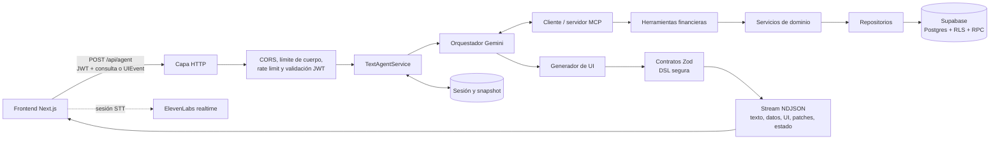
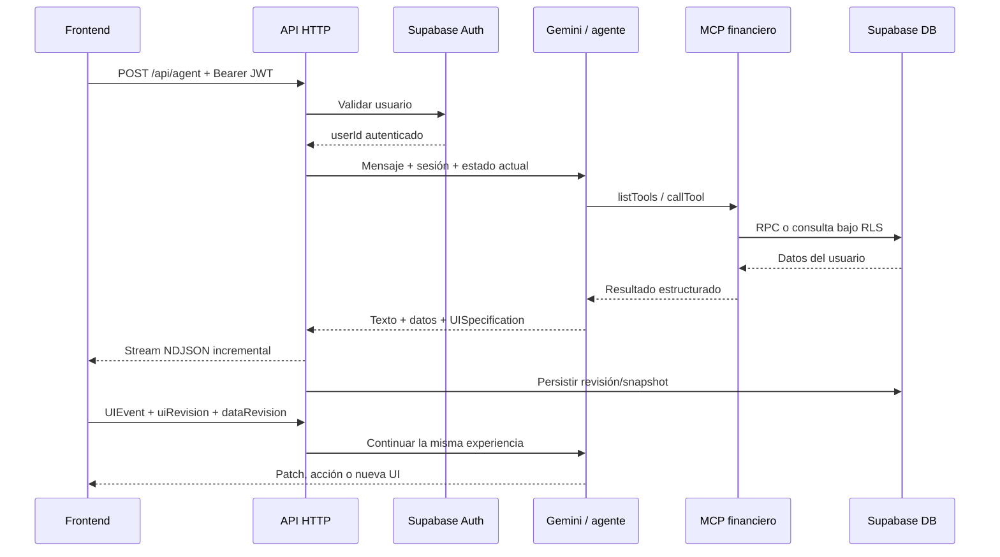
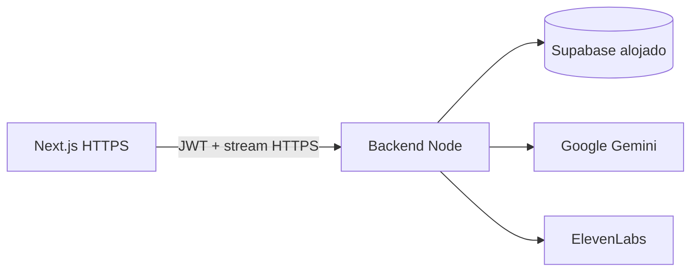

# Banorte GenUI — Backend

Backend del agente de **banca personal con interfaz generativa**. Orquesta Gemini, expone datos y acciones financieras mediante MCP, aplica autenticación y RLS con Supabase y transmite texto, datos, especificaciones de UI y patches al frontend.

La UI no se elige desde una lista de pantallas fijas: el agente consulta herramientas financieras y genera una composición declarativa validada. Las interacciones posteriores regresan al mismo agente para ejecutar una acción o transformar la interfaz, cerrando el ciclo solicitado por el reto.

## Qué demuestra

- Gemini es el centro de interpretación, razonamiento, selección de herramientas y composición de UI.
- MCP separa al agente de las herramientas, servicios y repositorios financieros.
- Una DSL tipada funciona como protocolo A2UI equivalente sin ejecutar código arbitrario.
- Supabase Auth, RLS y RPC aíslan los datos sintéticos por usuario.
- El stream NDJSON entrega progreso, texto, datos, UI y patches sin esperar una respuesta monolítica.
- ElevenLabs ofrece sesiones de transcripción en tiempo real sin exponer la API key.

## Arquitectura del backend



### Flujo completo de consulta, render e interacción



## Tecnologías

| Capa | Implementación |
|---|---|
| Runtime | Node.js 22 y TypeScript |
| Modelo | Google Gemini por API REST |
| Herramientas | Model Context Protocol SDK |
| Datos/autenticación | Supabase Auth + PostgreSQL + RLS + RPC |
| Contratos | Zod y paquete compartido `@banorte/contracts` |
| Transporte web | API HTTP con stream NDJSON |
| Transporte MCP | `stdio` |
| Voz | ElevenLabs Scribe realtime |

## Requisitos

- Git.
- Node.js **22 o superior**.
- Corepack y pnpm 10.34.5.
- Proyecto de Supabase; para Supabase local también Docker y Supabase CLI.
- API key de Google Gemini.
- API key de ElevenLabs sólo si se habilita voz.

## Instalación desde cero

```bash
git clone git@github.com:Usualldude21/BanorteBackend.git
cd BanorteBackend
nvm install
nvm use
corepack enable
corepack prepare pnpm@10.34.5 --activate
pnpm install --frozen-lockfile
cp .env.example .env
```

Los archivos `.nvmrc` y `.node-version` fijan Node 22. Comprueba la instalación con `node --version` y `pnpm --version`.

## Preparar Supabase

El esquema, migraciones, seed sintético y pruebas SQL están en `supabase/`. La guía detallada vive en [`supabase/README.md`](supabase/README.md).

### Opción A — Supabase local reproducible

```bash
supabase start
supabase db reset
```

`db reset` aplica todas las migraciones y `supabase/seed.sql`. Copia la URL y la clave pública informadas por la CLI al `.env` del backend y del frontend.

### Opción B — Proyecto Supabase alojado

```bash
supabase login
supabase link --project-ref TU_PROJECT_REF
supabase db push
```

Para un proyecto nuevo, crea además un usuario normal de demostración desde Supabase Auth y carga únicamente datos sintéticos asociados a su UUID. No uses datos bancarios reales ni desactives RLS para simplificar la demo.

## Variables de entorno

Parte de `.env.example`. Configuración mínima:

```dotenv
FINANCIAL_EXPERIENCE_SCOPE="personal_banking"
SUPABASE_URL="https://TU_PROYECTO.supabase.co"
SUPABASE_PUBLISHABLE_KEY="TU_CLAVE_PUBLICA"
SUPABASE_ACCESS_TOKEN=""

GEMINI_API_URL="https://generativelanguage.googleapis.com"
GEMINI_API_KEY="TU_API_KEY"
GEMINI_MODEL="gemini-3.7-flash"

AGENT_API_HOST="127.0.0.1"
AGENT_API_PORT="3101"
AGENT_API_ALLOWED_ORIGINS="http://localhost:3000,http://127.0.0.1:3000"
AGENT_API_TOKEN=""

ELEVENLABS_API_KEY=""
```

| Variable | Obligatoria | Uso |
|---|---:|---|
| `SUPABASE_URL` | Sí | URL del proyecto de datos y Auth. |
| `SUPABASE_PUBLISHABLE_KEY` | Sí | Clave pública para validar sesiones y operar con RLS. |
| `SUPABASE_ACCESS_TOKEN` | No | Token de usuario para herramientas/diagnóstico fuera de una petición HTTP. No es `service_role`. |
| `GEMINI_API_KEY` | Sí | Credencial del modelo; sólo backend. |
| `GEMINI_MODEL` | Sí | Modelo usado por el orquestador y generador. |
| `AGENT_API_HOST` / `PORT` | Sí | Interfaz IPv4 y puerto del servidor HTTP. |
| `AGENT_API_ALLOWED_ORIGINS` | Sí para navegador | Lista exacta separada por comas; no se acepta `*`. |
| `AGENT_API_TOKEN` | No | Compatibilidad legada; nunca identifica por sí solo al usuario bancario. |
| `ELEVENLABS_API_KEY` | Sólo voz | Se usa para emitir una sesión STT efímera. |
| `AGENT_MAX_TOOL_CALLS` | No | Límite del ciclo de herramientas. |
| `AGENT_TOOL_TIMEOUT_MS` | No | Timeout individual de herramienta. |
| `AGENT_AUTH_RATE_LIMIT_PER_MINUTE` | No | Límite de validaciones JWT por dirección de red. |
| `AGENT_API_RATE_LIMIT_PER_MINUTE` | No | Límite de operaciones costosas por usuario. |
| `MCP_WRITE_RATE_LIMIT_PER_MINUTE` | No | Umbral reducido para herramientas con escritura. |

No subas `.env`. No uses `service_role` y no registres JWT, contraseñas, audio o datos financieros completos en logs.

## Ejecución local

### API del agente para el frontend

```bash
pnpm api
```

La API queda en `http://127.0.0.1:3101`. Comprueba el endpoint público:

```bash
curl http://127.0.0.1:3101/api/system/status
```

Después configura en el frontend:

```dotenv
AGENT_API_URL=http://127.0.0.1:3101/api/agent
```

### Servidor MCP por stdio

```bash
pnpm dev
```

Este comando expone las herramientas MCP para un host compatible; no inicia la API web.

## Build y producción

```bash
pnpm build
pnpm api:start
```

El backend mantiene streaming, rate limits y sesiones en proceso, por lo que debe desplegarse como un servicio Node.js persistente compatible con respuestas largas; no como función de ejecución extremadamente corta.

## Endpoints HTTP

| Método y ruta | Auth | Propósito |
|---|---:|---|
| `GET /api/system/status` | No | Salud y capacidades sin exponer secretos. |
| `POST /api/agent` | JWT | Consulta, interacción y stream generativo. |
| `POST /api/agent/snapshot` | JWT | Recuperar la última revisión segura de una sesión. |
| `POST /api/integration/financial-summary` | JWT | Verificación de integración de datos. |
| `POST /api/transcription/realtime-session` | JWT | Crear sesión efímera de ElevenLabs STT. |

Las peticiones protegidas usan `Authorization: Bearer <JWT_DE_SUPABASE>`. El cuerpo máximo es 16 KiB. El backend valida el JWT con Supabase, obtiene el `userId` y todas las operaciones de datos respetan ese contexto.

El stream de `/api/agent` puede transportar eventos de progreso, deltas de texto, resultados de herramienta, registros de datos, UI completa, inicio de UI, patches, estado, errores y cierre. Frontend y backend deben mantener sincronizado el fingerprint de `@banorte/contracts`.

## Datos y herramientas MCP

Las herramientas cubren el giro elegido de banca personal, entre ellas:

- cuentas, saldos y resumen financiero;
- movimientos y gasto por categoría;
- flujo de efectivo y comparación de periodos;
- patrones o importes atípicos con explicación de solidez;
- estado de sesión y continuidad de la UI.

Cada herramienta valida entrada y salida. El flujo general es `tool -> service -> repository -> RLS/RPC`; Gemini no consulta tablas directamente.

## Seguridad y degradación

- CORS sólo acepta orígenes explícitos.
- Auth y operaciones costosas tienen rate limits separados.
- Los JWT se validan contra Supabase antes de crear contexto financiero.
- RLS aísla usuarios aun si una consulta se construye incorrectamente.
- La DSL de UI se valida con Zod y no permite HTML/JavaScript arbitrario.
- Sesiones, revisiones y snapshots evitan patches obsoletos y permiten recuperación.
- Timeouts, reintentos acotados y número máximo de tools evitan bucles del agente.
- Ante falta del modelo o voz, la API devuelve estado controlado; no inventa datos.

## ¿Es obligatorio subirlo a la nube?

**No.** El reto permite elegir libremente la infraestructura. Lo obligatorio es presentar una demo en vivo y entregar repositorio ejecutable, datos/APIs y documentación técnica con arquitectura y trade-offs.

Para evaluación remota, una topología recomendable es:



En la plataforma elegida:

1. Define `AGENT_API_HOST=0.0.0.0` si el proveedor lo requiere y asigna su puerto en `AGENT_API_PORT`.
2. Guarda Gemini, ElevenLabs y Supabase como secretos, nunca variables públicas.
3. Registra el dominio HTTPS exacto del frontend en `AGENT_API_ALLOWED_ORIGINS`.
4. Configura el frontend con la URL HTTPS pública terminada en `/api/agent`.
5. Verifica que el proxy no almacene ni corte el stream NDJSON.

## Validación

```bash
pnpm typecheck
pnpm build
pnpm test:challenge
pnpm test:i4
pnpm security:audit
```

`test:challenge` cubre los escenarios del reto y `test:i4` valida contratos/flujo integrado. Algunas pruebas reales necesitan `.env`, Supabase accesible y credenciales vigentes.

## Correspondencia con los entregables del reto

| Entregable | Evidencia en este repositorio |
|---|---|
| Servidor MCP | `src/server.ts`, herramientas en `src/tools` y cliente en `src/agent/mcp-client` |
| Datos/APIs | API HTTP, migraciones, RPC, RLS, seed y pruebas de Supabase |
| Capa A2UI o equivalente | DSL, generación, runtime, patches y contratos en `src/ui` |
| Ciclo cerrado | `UIEvent` con revisiones vuelve al agente y genera acción o UI |
| Repositorio ejecutable | Instalación, entorno, comandos y pruebas documentados aquí |
| Arquitectura/trade-offs | Diagramas, seguridad y decisiones documentadas en ambos README |

## Decisiones y trade-offs

- **MCP frente a acceso directo del LLM:** añade una capa, pero vuelve herramientas auditables, tipadas y reemplazables.
- **DSL segura frente a código generado:** reduce libertad absoluta de layout, pero evita ejecución arbitraria y conserva identidad visual.
- **NDJSON frente a JSON único:** mejora la respuesta percibida y habilita patches, a cambio de manejo explícito de continuidad.
- **Supabase/RLS frente a datos en memoria:** exige migraciones y credenciales, pero demuestra aislamiento y consultas realistas.
- **Dos procesos frente a monolito:** frontend y agente escalan/securizan por separado, a cambio de CORS y contratos compartidos.
- **Banca personal enfocada:** prioriza profundidad y calidad sobre cubrir pagos y educación financiera superficialmente.

## Estructura relevante

```text
src/http/                 servidor HTTP, auth, CORS, límites y endpoints
src/agent/                orquestación del modelo y ciclo de herramientas
src/agent/mcp-client/     cliente Model Context Protocol del agente
src/server.ts             servidor MCP y transporte stdio
src/tools/                herramientas financieras expuestas al agente
src/services/             reglas de negocio
src/repositories/         acceso a Supabase bajo contexto de usuario
src/ui/                   DSL, generación, interacción, runtime y streaming
src/transcription/        integración de ElevenLabs
packages/contracts/       contrato compartido con el frontend
supabase/migrations/      esquema, RLS, RPC y persistencia de sesiones/UI
supabase/seed.sql         datos exclusivamente sintéticos
supabase/tests/            verificaciones SQL y de políticas
```

## Checklist de demo

1. `GET /api/system/status` confirma modelo, datos y voz sin revelar claves.
2. El JWT pertenece a un usuario demo con datos sintéticos y RLS activa.
3. Una pregunta abierta obliga al agente a seleccionar tools y una composición adecuada.
4. Una interacción o edición produce patch/nueva UI en la misma sesión.
5. Las conclusiones se sustentan con movimientos visibles y no con datos inventados.
6. Los logs y el repositorio no contienen secretos ni información financiera real.
