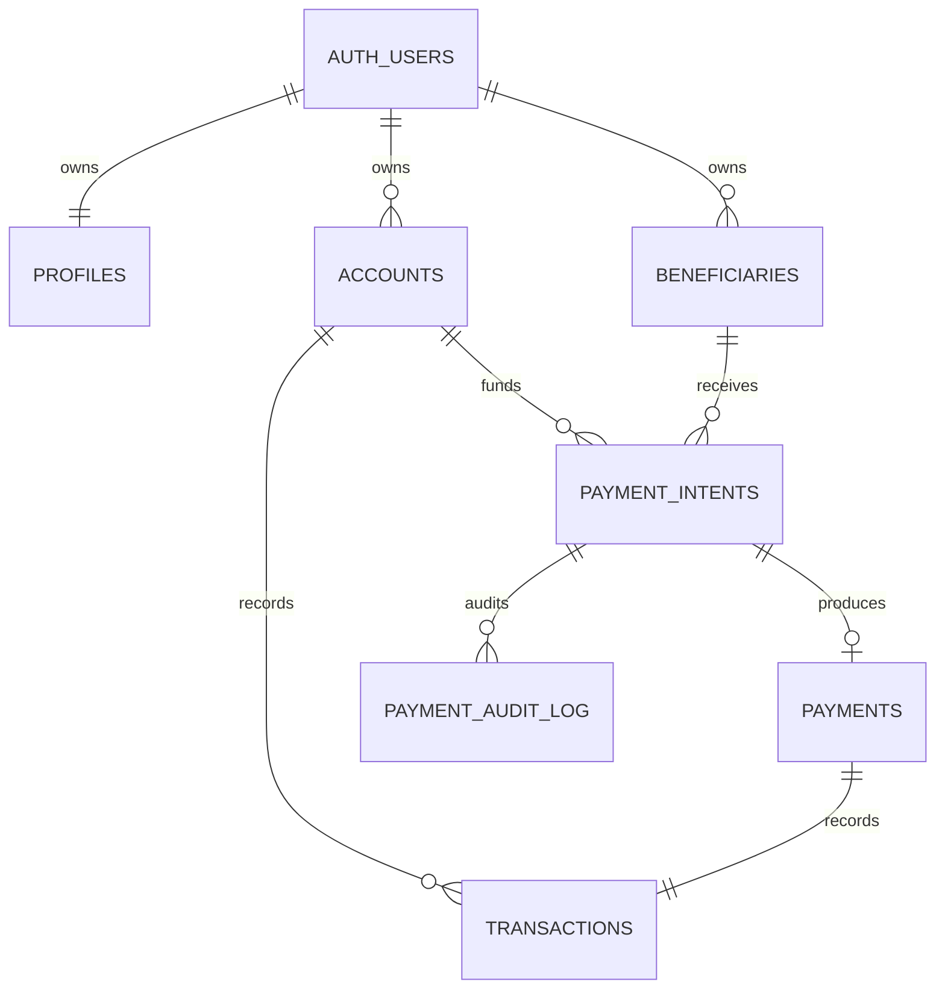

# Escenario de datos de demostración

La historia usa un calendario fijo en UTC: junio, julio y agosto de 2026. Andrea Demo es la usuaria principal; Bruno permite comprobar aislamiento RLS y Carla cubre saldo bajo y beneficiarios no disponibles. Todos los nombres, correos, identificadores y movimientos son sintéticos.

## D0 — historia y resultados conocidos

Andrea recibe dos nóminas mensuales de $15,000 MXN. Renta y transporte permanecen estables. Restaurantes sube de $2,450 en junio a $5,250 en agosto. En agosto aparece una compra de entretenimiento de $6,000, que el análisis IQR detecta como atípica frente a cinco compras comparables. El flujo neto de agosto es $2,400 y la tasa de ahorro 8%.

Las respuestas esperadas son:

| Pregunta | Resultado de demo |
|---|---|
| Disponible en cuenta principal | $22,500 MXN antes del pago |
| Mayor gasto de agosto | Vivienda, $8,500 MXN |
| Cambio frente a julio | Gastos +$6,950; flujo neto -$6,950 |
| Razón del menor ahorro | Restaurantes y entretenimiento suman $11,750 en agosto |
| Ahorrar $2,000/mes | Ya es viable con el margen actual de $2,400 |
| Ahorrar $3,000/mes | Reducir $600 entre restaurantes y entretenimiento |
| Ahorrar $4,000/mes | Reducir $1,600 entre restaurantes y entretenimiento |
| Pago de $1,500 | Exitoso; saldo posterior $21,000 |
| Pago deliberadamente alto | Falla por fondos insuficientes sin cambiar el saldo |
| Confirmar dos veces | Devuelve el mismo comprobante; queda un pago y un movimiento |

## D1 — modelo

El esquema usa `numeric(18,2)`, códigos ISO 4217, claves foráneas compuestas para impedir cruces de usuario y moneda, identificadores enmascarados y estados controlados con `check`. `transaction_date` es `date` porque el backend y `@banorte/contracts` esperan `YYYY-MM-DD`; `created_at` conserva el instante UTC.

## D2–D3 — migraciones, RLS y permisos

Las migraciones se ejecutan en orden por timestamp. Las tablas sólo permiten `select` de filas propias; beneficiarios además exige estado activo. El rol `authenticated` no recibe mutaciones directas ni acceso a auditoría. Las funciones `security definer` fijan `search_path`, toman la identidad de `auth.uid()` y rechazan un `p_user_id` distinto.

## D4–D6 — análisis, educación y pagos

`get_financial_summary`, `get_spending_by_category` y `get_cashflow` separan monedas, usan rangos inclusivos y orden determinista. Los pagos siguen `create_payment_intent` → confirmación explícita → `confirm_payment`. La confirmación bloquea intent y cuenta, vuelve a validar propiedad, estado, moneda, beneficiario y saldo, y crea balance, movimiento, pago, comprobante y auditoría en la misma transacción.

## D7–D8 — seed y validación

El seed crea tres usuarios, cinco cuentas, cuatro beneficiarios, 75 movimientos para Andrea y estados expirado/cancelado. Sus UUID y fechas son fijos. Volver a ejecutar el seed restaura el saldo de Andrea y elimina sólo los pagos interactivos de esa usuaria. `data_validation.sql` verifica invariantes, fixtures y aislamiento; `payment_flow.sql` cubre éxito, saldo insuficiente, moneda, beneficiario, expiración e idempotencia secuencial.

La concurrencia se valida abriendo dos sesiones con el mismo JWT y ejecutando `confirm_payment` para el mismo intent al mismo tiempo. El bloqueo `FOR UPDATE` hace que la segunda espere y reciba el comprobante ya creado. Después deben existir exactamente un pago y un movimiento.

## D9–D10 — entrega, preparación y recuperación

El backend consume los nombres de parámetros documentados en `README.md`. El frontend recibe fixtures camelCase y nunca ve auditoría, números completos ni credenciales. La preparación recomendada es `supabase db reset`, que aplica migraciones y `seed.sql`; a continuación se ejecutan ambas suites SQL. Repetir el reset restaura por completo la demo sin editar filas manualmente.
